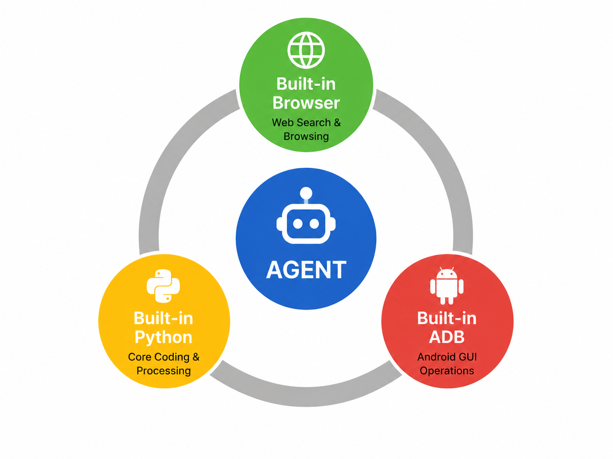

# ActMe

ActMe 是一个面向中文个人行动管理的 Android App。它把聊天 Agent、个人记忆、日程提醒、联网搜索、内置浏览器、内置 Python、Excel/文件处理、本地 ASR 和轻量 ADB 自动化放在同一个移动端体验里，让用户用自然语言完成记录、查询、规划、分析和执行。

ActMe 的核心不是单轮聊天，而是一个可见、可控、可中止的移动端 Agentic Loop：大模型负责规划和总结，App 内置能力负责真实执行，用户可以看到每一步并随时停止。



## 核心能力

- **ActMe Agent**：中文对话入口，支持文本、图片、语音输入、Markdown 展示、多轮上下文、Memory、Schedule 和 Skill。
- **多步工具执行**：Agent 可以在一次回复中多轮调用工具，观察结果后继续搜索、浏览、运行 Python、生成文件或执行 ADB。
- **内置浏览器**：基于 GeckoView 的网页搜索、URL 打开和渲染后文本读取，用于动态网页和权威来源验证。
- **内置 Python**：基于 Chaquopy 的 Python 3.11 执行环境，支持标准库和已安装 Python 包，用于计算、解析、表格处理、脚本复用和文件生成。
- **Excel 和通用文件输出**：支持读取 `.xlsx/.xlsm`，生成 Excel、PDF、CSV、图片、JSON、文本等工作区文件，并在聊天中显示可打开的文件按钮。
- **内置 ADB**：通过无线调试配对和悬浮窗，允许 Agent 在用户授权后观察和操作本机 Android 环境。
- **可见执行步骤**：搜索、浏览、Python、ADB 等工具执行会显示在聊天气泡中，支持停止和后续继续。
- **Token 用量显示**：assistant 消息下方显示 API 返回的 token 用量；不支持 usage 的接口回退到本地估算。
- **本地 ASR**：使用 MNN 模型进行本地语音识别。

## 三驾马车

ActMe 的执行层由三类内置能力组成：

1. **内置浏览器**：获取网页和当前信息。
2. **内置 Python**：做确定性计算、数据处理和文件生成。
3. **内置 ADB**：观察和操作本机 Android 环境。

这三类能力由 Agentic Loop 调度，可以组合成更长的工作流，例如“搜索多个来源 -> 浏览官网 -> Python 清洗数据 -> 生成 Excel/PDF -> 返回文件按钮”。

## 文档入口

- [Agent.md](Agent.md)：Agent 总体设计、system calls、多步循环、Memory、Skill 和 UI 展示。
- [docs/BUILTIN_CAPABILITIES.md](docs/BUILTIN_CAPABILITIES.md)：三驾马车总览。
- [docs/BUILTIN_BROWSER.md](docs/BUILTIN_BROWSER.md)：内置浏览器和网页阅读。
- [docs/BUILTIN_PYTHON.md](docs/BUILTIN_PYTHON.md)：内置 Python、沙箱、Excel、文件输出。
- [docs/BUILTIN_ADB.md](docs/BUILTIN_ADB.md)：内置 ADB 配对、悬浮窗和 shell 执行。
- [docs/AGENTIC_LOOP.md](docs/AGENTIC_LOOP.md)：多步 Agent 执行循环。
- [docs/SKILL_MEMORY_DESIGN.md](docs/SKILL_MEMORY_DESIGN.md)：Skill 与 Memory 设计。
- [RELEASE_NOTES.md](RELEASE_NOTES.md)：版本更新记录。

## 技术栈

- Kotlin 2.1.0
- Android Gradle Plugin 8.9.2
- Jetpack Compose + Material 3
- Room
- Kotlin Coroutines / Flow
- Kotlinx Serialization
- OkHttp
- GeckoView
- Chaquopy / Python 3.11
- openpyxl and other packaged Python libraries
- MNN / Qwen3-ASR

## 项目结构

```text
app/src/main/java/com/actme/app/
  data/
    agent/            ActMeAgent, SystemSkillExecutor, GeckoSearchEngine,
                      PythonSkillEngine, AdbSkillEngine
    local/            Room entities, DAO, database migrations
    remote/           OpenAI-compatible / Anthropic-compatible API client
    repo/             ActMeRepository, Agent loop and persistence
  ui/
    chat/             Chat UI, tool bubbles, file buttons, token tags
    settings/         Provider, ASR, built-in browser, ADB settings
    memory/           Memory management
    schedule/         Schedule management
  audio/              Local ASR manager
  mnn/                MNN model loading and inference wrappers
  notifications/      Reminder scheduling

app/src/main/python/
  agent_python.py     Python sandbox, Excel helpers, script helpers, file tracking

docs/
  Built-in capability and Agent design documents
```

## 本地构建

### 前置条件

1. Android Studio with JDK 17.
2. Android SDK 34.
3. NDK `27.2.12479018`.
4. CMake `3.22.1` or Android SDK bundled CMake.
5. Initialized `MNN` submodule.

### 克隆

```bash
git clone --recursive https://github.com/huangzhengxiang/ActMe.git
cd ActMe
```

如果已经克隆但缺少 submodule：

```bash
git submodule update --init --recursive
```

### 构建 APK

仓库当前不要求 Gradle wrapper；可以使用本机 Gradle：

```bash
gradle assembleDebug
```

如本地已有 wrapper，也可以使用：

```bash
./gradlew assembleDebug
```

### 构建 MNN 原生库

```bash
gradle buildMnn
```

`buildMnn` 会用 CMake + NDK 编译 arm64-v8a 的 `libMNN.so`，并复制到 App 的 `jniLibs/arm64-v8a/`。

## 运行配置

首次启动后，在设置页配置 API provider：

- Provider format: `openai` 或 `anthropic`
- Endpoint: 例如 `https://api.openai.com/v1`
- API Key
- Model

OpenAI-compatible provider 使用 `/chat/completions`；Anthropic-compatible provider 使用 `/messages`。

## Agent system_calls

Agent 通过 JSON 请求 App 执行系统工具：

```json
{
  "reply": "",
  "memory_updates": [],
  "schedule_updates": [],
  "skill_updates": [],
  "system_calls": [
    {"type": "web_search", "query": "搜索内容"},
    {"type": "browse_url", "url": "https://example.com"},
    {"type": "python_exec", "code": "emit({'answer': 2 + 2})", "timeout_ms": 3000},
    {"type": "adb_shell", "command": "dumpsys window | head -50", "timeout_ms": 15000}
  ]
}
```

当前主要工具：

- `get_current_time`
- `web_search`
- `browse_url` / `browser_url` / `web_browse` / `open_url`
- `python_exec`
- `adb_shell` / `adb` / `run_adb`

工具结果会进入 Agentic Loop，Agent 可以继续调用工具或给出最终回复。

## Python 与文件输出

`python_exec` 支持：

```python
input_text
input_json
emit(value)
set_result(value)
result
workspace_dir
read_excel(path, max_rows=200, max_sheets=10)
write_excel(filename, sheets)
save_script(name, source)
load_script(name)
list_scripts()
compile_script(name)
run_script(name)
```

Python 执行前后会扫描 `agent_workspace`，自动收集新增或修改的文件。Agent 也可以在 tool call 中声明：

```json
{
  "type": "python_exec",
  "code": "path = write_excel('report.xlsx', {'Sheet1': [['A', 1]]}); emit({'file': path})",
  "output_files": ["report.xlsx"]
}
```

最终聊天气泡会显示文件按钮。支持的常见类型包括 Excel、PDF、CSV、图片、JSON、Markdown 和文本。

## 调试

常用 logcat 过滤：

```bash
adb logcat -v time | grep -E "ActMe|AgentFile|SystemSkillExecutor|GeckoSearchEngine|PythonSkillEngine|BROWSE|SEARCH|PYTHON|system_calls"
```

Windows PowerShell：

```powershell
adb logcat -v time | Select-String -Pattern "ActMe|AgentFile|SystemSkillExecutor|GeckoSearchEngine|PythonSkillEngine|BROWSE|SEARCH|PYTHON|system_calls"
```

`AgentFile` 用于定位文件输出链路：

- Python 是否生成并返回文件。
- Repository 是否在每一轮工具执行后收集到文件。
- Chat bubble 是否识别到可显示的文件按钮。

## 注意事项

- 金融、银行、价格、政策等信息应优先让 Agent 搜索并浏览权威来源。
- 搜索和网页阅读结果是辅助资料，最终回复仍由 Agent 综合工具结果生成。
- 部分网页需要登录、强风控或 App 内跳转，内置浏览器可能只能读取公开页面文本。
- Python 文件写入限制在 `agent_workspace` 内；进程、native code、系统 shell 和包安装能力受限。
- ADB 是高权限能力，配对和连接必须由用户主动授权，高风险命令需要明确确认。
- 本地 ASR 模型体积较大，首次下载或推送需要较长时间。
