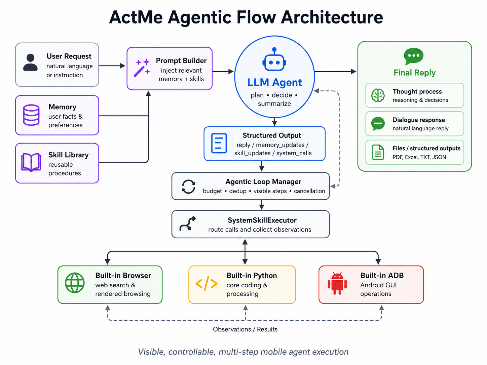

# ActMe

ActMe 是一个面向中文个人行动管理的 Android 应用。它把聊天 Agent、个人记忆、日程提醒、本地语音识别、联网搜索、内置浏览器、轻量 Python 执行环境和 Excel 工作流放在同一个移动端体验里，让用户用自然语言完成记录、查询、规划、分析和执行。以内置浏览器、内置Python、内置ADB作为赋能核心的三驾马车，为整体Agent端侧能力提升构建关键基础。


项目以本地优先为核心：记忆、日程、聊天记录、Skills、提醒、ASR 模型和 Agent 工作区都保存在本机；LLM 对话通过用户配置的 OpenAI-compatible 或 Anthropic-compatible API 完成；联网搜索、网页阅读、Python 执行和 Excel 处理由 App 内置系统能力按需执行。



## 核心功能

- **ActMe Agent 聊天**：中文对话入口，支持文本、图片、语音输入、Markdown 展示和多轮上下文。
- **多步工具执行**：Agent 可以在一次回复中多轮调用系统能力，观察结果后继续搜索、浏览网页、运行 Python 或生成文件。
- **可见、可控、可中止**：工具步骤会在聊天中显示；发送过程中可点击停止按钮取消当前任务。
- **联网搜索与网页阅读**：支持 `web_search` 搜索，以及 `browse_url` / `browser_url` 使用内置 GeckoView 浏览器读取渲染后的网页文本。
- **轻量内置 Python**：通过 Chaquopy 内置 Python 3.11，提供 `python_exec` 沙箱，用于计算、解析、排序、去重、JSON/CSV/表格处理和 Excel 读写。
- **运行期 Python 工具维护**：Agent 可在工作区保存 `.py` 脚本、执行 `compile_script` 语法检查，并通过 `run_script` 复用脚本。
- **Excel 工作流**：支持在聊天输入区选择 `.xlsx/.xlsm`；支持从系统“用 ActMe 打开/分享”载入 Excel；支持 Agent 用 Python 生成 Excel 并在聊天中返回可打开文件。
- **联网资料展示**：搜索结果和网页阅读内容会作为可展开资料显示，区分搜索结果、网页阅读内容和混合联网资料。
- **Token 用量显示**：assistant 消息下方显示 API 返回的输入、输出、总 token；API 不返回 usage 时回退到本地估算。
- **个人记忆管理**：支持短期目标、长期目标、个人焦虑、近期烦恼、偏好、人际关系、健康状态、学习工作等分类。
- **日程与提醒**：Agent 可生成日程候选，经子 Agent 二次结构化后保存，并注册 Android 提醒。
- **本地 ASR**：使用 Qwen3-ASR MNN 模型进行离线语音识别，模型可通过 App 下载或 Gradle task 推送。
- **内置浏览器调试入口**：设置页提供“内置浏览器”入口，用于直接验证 GeckoView 页面加载和渲染文本读取。

## 文档

- [Agent.md](Agent.md)：ActMe Agent 的详细设计，包括系统提示、工具协议、多步执行、Python 沙箱、Excel 工作流、联网搜索、内置浏览器、JSON 解析兜底、token usage 和 UI 展示。
- [RELEASE_NOTES.md](RELEASE_NOTES.md)：版本更新记录。

## 技术栈

- Kotlin 1.9.24
- Android Gradle Plugin 8.5.2
- Jetpack Compose + Material 3
- Room
- Kotlin Coroutines / Flow
- Kotlinx Serialization
- OkHttp
- GeckoView
- Chaquopy / Python 3.11
- openpyxl
- MNN / Qwen3-ASR
- Markdown Renderer for Compose

## 项目结构

```text
app/src/main/java/com/actme/app/
  data/
    agent/            ActMeAgent、SystemSkillExecutor、GeckoSearchEngine、PythonSkillEngine
    local/            Room entities、DAO、database migrations
    remote/           OpenAI-compatible / Anthropic-compatible API client
    repo/             ActMeRepository，连接 UI、Agent、数据库和提醒系统
  ui/
    chat/             聊天主界面、消息气泡、文件附件、Excel 打开按钮、语音输入、资料面板
    settings/         模型、API provider、ASR、内置浏览器入口
    memory/           记忆管理
    schedule/         日程管理
  audio/              本地 ASR 管理
  mnn/                MNN 模型加载和推理封装
  notifications/      提醒调度、通知和开机恢复

app/src/main/python/
  agent_python.py     Python 沙箱运行器、Excel 读写、运行期脚本维护
```

## 本地构建

### 前置条件

1. Android Studio，JDK 17。
2. Android SDK 34。
3. NDK `27.2.12479018`。
4. CMake `3.22.1` 或 Android SDK 中可用的 CMake。
5. Git submodule 已初始化，尤其是 `MNN`。
6. 首次构建会下载 Chaquopy 和 Python 包依赖，包括 `openpyxl`。

### 克隆项目

```bash
git clone --recursive git@github.com:huangzhengxiang/ActMe.git
cd ActMe
```

如果已经克隆但没有拉取 submodule：

```bash
git submodule update --init --recursive
```

### 构建 APK

仓库当前未提交 Gradle wrapper 时，可以使用本机 Gradle：

```bash
gradle assembleDebug
```

如果本地添加了 Gradle wrapper，也可以使用：

```bash
./gradlew assembleDebug
```

### 构建 MNN 原生库

```bash
gradle buildMnn
```

`buildMnn` 会用 CMake + NDK 交叉编译 arm64-v8a 的 `libMNN.so`，并复制到 App 的 `jniLibs/arm64-v8a/`。

### 推送 ASR 模型到设备

```bash
gradle pushAsrModel
```

模型路径：

```text
model/Qwen3-ASR-0.6B-INT8-MNN
```

设备路径：

```text
/sdcard/actme/models/Qwen3-ASR-0.6B-INT8-MNN
```

也可以在 App 设置页中下载模型。

## 运行配置

首次启动后，在设置页配置 API provider：

- Provider format: `openai` 或 `anthropic`
- Endpoint: 例如 `https://api.openai.com/v1`
- API Key
- Model

OpenAI-compatible provider 使用 `/chat/completions`；Anthropic-compatible provider 使用 `/messages`。

## Agent 工作流概览

聊天发起后，Repository 会把当前输入、历史消息、记忆、日程、Skills 和系统提示传给 ActMeAgent。Agent 输出 JSON，可能包含：

```json
{
  "reply": "给用户的中文回复",
  "memory_updates": [],
  "schedule_updates": [],
  "skill_updates": [],
  "system_calls": []
}
```

当 `system_calls` 非空时，App 会执行系统工具，并把结果返回给 Agent 继续生成下一步。当前系统能力包括：

- `get_current_time`
- `web_search`
- `browse_url`
- `browser_url`，作为 `browse_url` 的兼容别名
- `web_browse` / `open_url`，作为浏览网页兼容别名
- `python_exec`

`python_exec` 支持的运行期能力包括：

- `input_text` / `input_json`
- `emit(value)` / `set_result(value)` / `result`
- `read_excel(path, max_rows=200, max_sheets=10)`
- `write_excel(filename, sheets)`
- `save_script(name, source)`
- `load_script(name)`
- `list_scripts()`
- `compile_script(name)`
- `run_script(name)`

## Excel 使用方式

### 从聊天中选择 Excel

聊天输入区的附件按钮可选择 `.xlsx/.xlsm`。文件会复制到 App 私有工作区，用户发送问题后，Agent 可用 Python 读取和分析。

### 从系统打开 Excel

ActMe 注册了 Excel 文件打开/分享入口。用户在文件管理器、下载列表或其他 App 中选择“用 ActMe 打开/分享”时，文件会载入当前会话输入区，用户确认问题后再发送。

### 生成 Excel

Agent 可以通过 Python 调用：

```python
write_excel("report.xlsx", {
    "Summary": [
        ["category", "amount"],
        ["A", 120],
        ["B", 300]
    ]
})
```

生成的 `.xlsx/.xlsm` 路径会显示在聊天消息下方，用户可点击按钮用系统 Excel/WPS 等应用打开。

## 调试建议

常用 logcat 过滤：

```bash
adb logcat -v time | grep -E "ActMe|SystemSkillExecutor|GeckoSearchEngine|PythonSkillEngine|BROWSE|SEARCH|PYTHON|system_calls"
```

Windows PowerShell：

```powershell
adb logcat -v time | Select-String -Pattern "ActMe|SystemSkillExecutor|GeckoSearchEngine|PythonSkillEngine|BROWSE|SEARCH|PYTHON|system_calls"
```

设置页的“内置浏览器”入口可用于验证 GeckoView 是否能加载网页、安装 WebExtension、返回渲染文本。

## 注意事项

- 金融、银行、价格、政策等信息应优先让 Agent 搜索并浏览权威来源；Agent 会根据任务复杂度和用户意图决定工具调用数量。
- 搜索和网页阅读结果是辅助资料，不等同于最终事实；最终回答由 Agent 综合工具结果生成。
- 部分网页需要登录、强风控或 App 内渠道，内置浏览器可能只能读取公开页面文本。
- Python 沙箱没有网络访问，只能访问 `agent_workspace` 工作区；联网应通过 `web_search` / `browse_url` 完成。
- Excel 第一版主要支持 `.xlsx/.xlsm`；旧 `.xls` 不保证可读。
- Token usage 优先使用 API 返回值；不支持 usage 的兼容接口会回退估算。
- 本地 ASR 模型体积较大，首次下载或推送需要较长时间。
